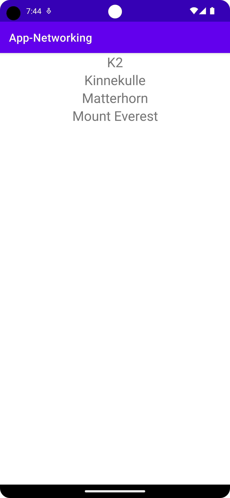

# Rapport

Först skapades en recycler view i `activity_main.xml` för att hämta in data från en json url. 
Därefter lades ytterligare en xml fil till med namnet itemrow.xml för att lista alla berg. 

Därefter skapades två javafiler, `JsonTask.java` och `JsonFile.java`. Jag valde dock att använda 
JsonTask och köra via url. 


Sedan skapades `Mountains.java` där valdes att bergens namn skulle inhämtas som variabel. Detta gjordes
med getter och setter. 

Därefter skapades `RecyclerViewItem.java`. I denna fil lades kod till för att hämta namnen på bergen 
till recycler view. 

I manifestet lades kod till för åtkomst till internet: 
```
<uses-permission android:name="android.permission.INTERNET" />

```

Efter det skapades `RecyclerViewAdapter.java` här inne skapades även en holder. 
Även arraylist Mountains skapades i `MainActivity.java` med variabeln mountains.



